# PTAMM

This software is an implementation of the method described in the paper Parallel tracking and mapping for small AR workspaces by Robert Castle, Georg Klein and David Murray, which appeared in the proceedings of the IEEE and ACM International Symposium on Mixed and Augmented Reality (ISMAR) 2007. (http://www.robots.ox.ac.uk/~gk/PTAM/)

## Requirements

**CPU Minimal**:
* Intel Core 2 Duo processors @ 2.4GHz+

**CPU Optimal**:
* Intel Core i7 @ 3.4GHz

**SO**: Ubuntu 18.04

**Compiler**: g++ -std=c++11

## Dependencies:

The software has four principal dependencies:

1. TooN - a header library for linear algebra.
2. libCVD - a library for image handling, video capture and computer vision.
3. Gvars3 - a runtime configuration/scripting library, this is a subproject of libCVD.
4. lib3ds - a library for handling 3DS model files.

The first three above are written by members of the Cambridge Machine Intelligence lab and are licensed under the LGPL. Current versions are available from Edward Rosten via GIT:

```
$> git clone https://github.com/edrosten/TooN
$> git clone https://github.com/edrosten/libcvd.git
$> git clone https://github.com/edrosten/gvars.git
```

For more information about how to compile these libraries read the [Manual](https://github.com/dpalominop/PTAM/blob/master/Manual.pdf).

## How to Compile the Software

The source code is in the PTAMM directory. For Linux systems all files are in theirs correct location. The Makefile can then be edited to reference any custom include or linker paths which might be necessary (depending on where the dependencies were installed.)

The second step, for Linux, is to set up the correct video source: **VideoSource_Linux_V4L.cc** in the Makefile (it's done for default).

If you do not want to use the lib3ds based AR game, then the Makefile can be simply modified to remove the associated files, and lib3ds will then not be required.

The software can then be compiled with the command:

```
$> make
```

This builds two target executables: PTAMM and CameraCalibrator.

# Running the Software

## Calibrating the Camera

**CameraCalibrator** executable should be run first to obtain a camera calibration (and to verify that video input is in fact working.) This requires the user to point the camera at a checker board calibration pattern; any checker board of any size will do, a sample is included as **calib_pattern.pdf**.

The camera calibrator attempts to find square corners in the image, and then to link these together. This is indicated by fragments of squares appearing in the image. The calibrator is not very robust; If no squares are detected, some things to try would be:

1. Modify camera settings to remove any sharpening; Sharpening artifacts break the calibrator, and also reduce performance of the tracker.
2. Adjust the calibrator’s settings, for example increase the value of CameraCalibrator.BlurSigma

When the camera is in a pose in which some portions of the grid are detected, the user should press the 'GrabFrame' button to add a snapshot of that frame to the optimiser. 

After a few frames from different poses have been added, pressing 'Optimize' button iteratively calculates the camera parameters. When the user is satisfied with convergence (the RMS error should be no more than around 0.3 pixels) pressing 'Save' stores the camera calibration in a file **camera.cfg**. 


## Running the Tracker

Once a calibration has been stored, invoking **PTAMM** executable runs the tracker. At the start, the tracker requires the user to provide a stereo pair to initialise the map. The user does this by pointing the camera at an angle to a planar (or near-planar) surface to be augmented, pressing **spacebar**, slowly translating the camera to provide a baseline, and pressing **spacebar** again to complete the stereo pair. At this point a map is created and the tracker runs. Augmented graphics can be shown once the tracker is running by first pressing the **Draw AR** toggle button, then selecting a game from the Demos menu.

1. Point the Camera at planar scene and press spacebar to start for initial map.

<div class="row">
  <div class="column">
    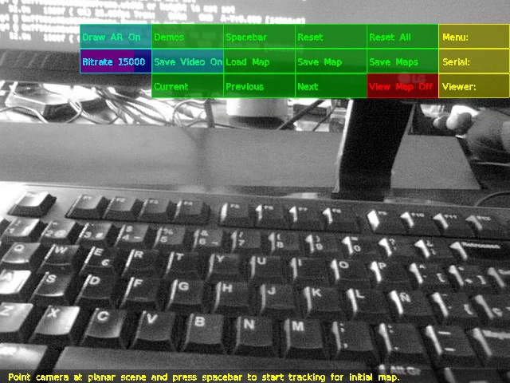
    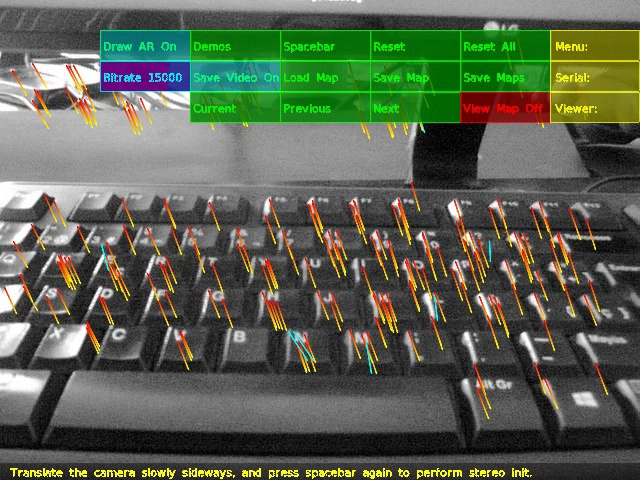
  </div>
  <div class="column">
    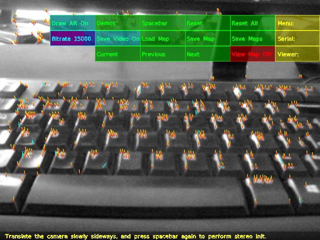
    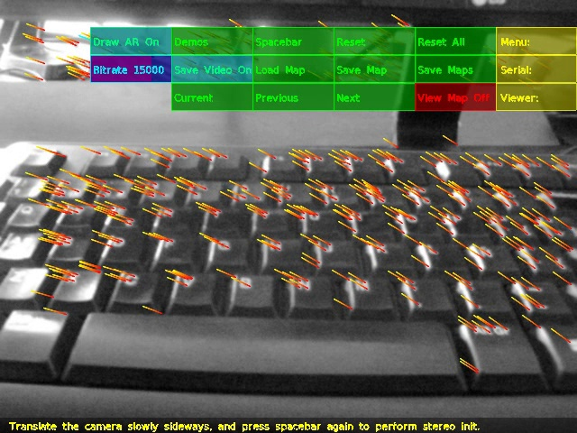
  </div>
  <div class="column">
    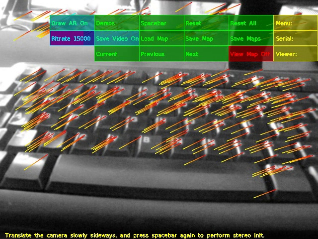
    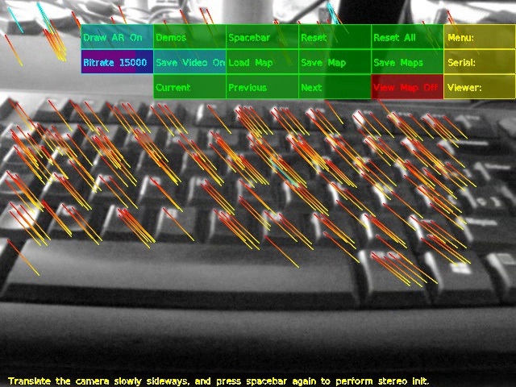
  </div>
</div>

2. Visualize the map created.

<div class="row">
  <div class="column">
    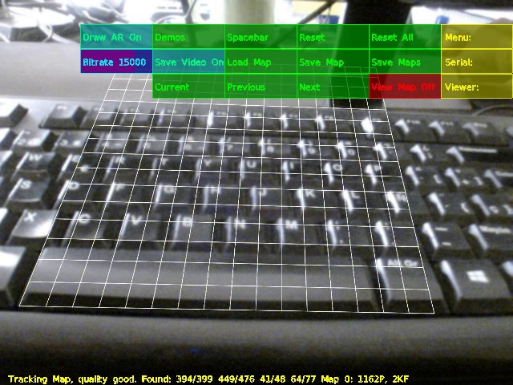
    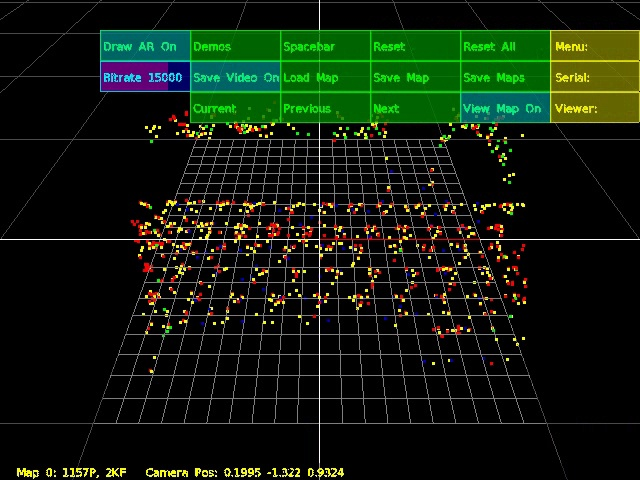
  </div>
</div>

3. Choose the AR model.

<div class="row">
  <div class="column">
    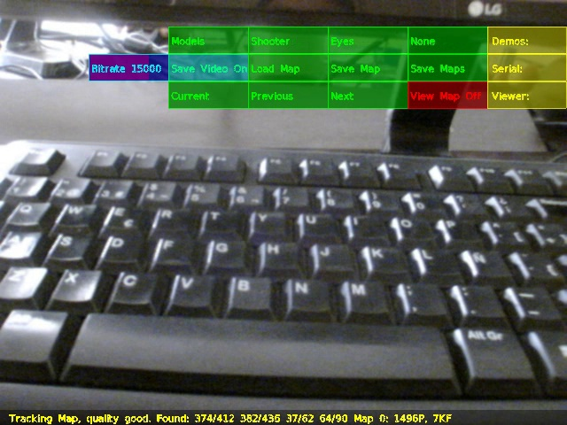
    
  </div>
  <div class="column">
    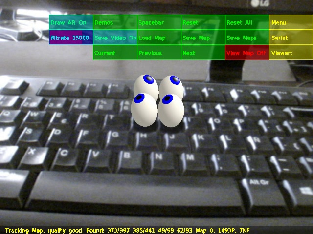
    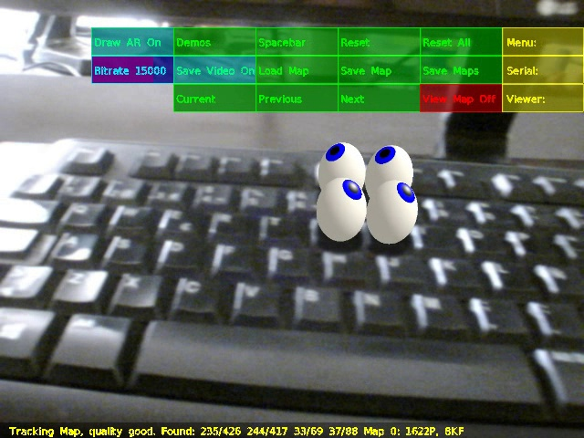
  </div>
</div>

# Demo

[](https://www.youtube.com/watch?v=c-BEgujPG10)


# References
* Klein, G & Murray, D. (2007). Parallel tracking and mapping for small AR workspaces. ISMAR. IEEE. 225-234. (http://www.robots.ox.ac.uk/~gk/PTAM/)
